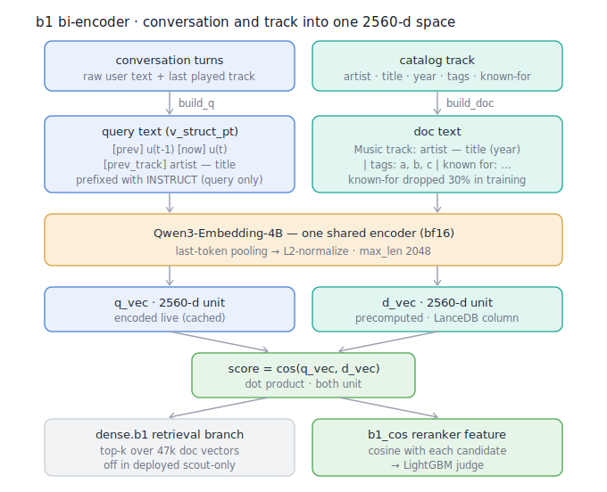

# b1 Bi-Encoder (conv→track retriever / `b1_cos` reranker feature)

`b1` is a fine-tuned **two-tower bi-encoder** that maps a conversation and a track
into the **same 2560-dim vector space**, so that the right track for a turn is the
nearest catalog vector. It is used two ways:

1. **`dense.b1` retrieval branch** — top-k over the 47k catalog doc matrix (a candidate source).
2. **`b1_cos` reranker feature** — cosine(conversation vector, candidate's doc vector), fed to the LightGBM judge.

> The deployed config is **scout-only**: it keeps `b1_cos` as a reranker feature and
> drops the `dense.b1` retrieval branch (the branch added negligible union recall but
> a second ANN call). See [reproduce_reranker](../reproduce_reranker.md).

## Architecture



<details>
<summary>Same diagram as text (terminal / plain-text viewers)</summary>

```
            QUERY TOWER (live, per turn)                 DOC TOWER (precomputed, 47k tracks)
        ┌──────────────────────────────┐            ┌──────────────────────────────────┐
        │ conversation turns (raw text) │            │ track metadata (catalog row)      │
        │  prev user turn / now / prev  │            │  artist, title, year, tags,       │
        │  played track                 │            │  LLM "known for" line             │
        └──────────────┬───────────────┘            └─────────────────┬────────────────┘
                       │ build_q("v_struct_pt", …)                     │ build_doc(...)
                       ▼                                               ▼
     "[prev] <u_{t-1}> [now] <u_t> [prev_track] <artist — title>"   "Music track: <artist> — <title>
                       │                                              (<year>) | tags: a,b,c | known for: …"
                       │ prepend INSTRUCT prefix                       │  (doc_nokf = drop the known-for line)
                       ▼                                               ▼
        ┌──────────────────────────────────────────────────────────────────────────────┐
        │             Qwen3-Embedding-4B   (ONE shared encoder, bf16)                    │
        │             last-token pooling (left-padded)  →  L2-normalize                  │
        └──────────────┬───────────────────────────────────────────────┬───────────────┘
                       ▼                                               ▼
                 q_vec ∈ ℝ²⁵⁶⁰ (‖q‖=1)                          d_vec ∈ ℝ²⁵⁶⁰ (‖d‖=1)
                       └───────────────────────┬───────────────────────┘
                                               ▼
                       score = cos(q_vec, d_vec) = q_vec · d_vec   ∈ [-1, 1]
                       ├─ top-k over all d_vec  →  dense.b1 retrieval branch
                       └─ cos with a candidate  →  b1_cos  (LightGBM feature)
```

</details>

**Single shared encoder.** Both towers are the *same* fine-tuned `Qwen/Qwen3-Embedding-4B`
weights (a Siamese setup). The only asymmetry is the **query-side INSTRUCT prefix** — the
doc side gets no prefix. Because both outputs are L2-normalized, cosine == dot product.

## Inputs / outputs

| | Query tower | Doc tower |
|---|---|---|
| **Raw input** | the conversation up to turn `t` (raw user turns + last played track) | one catalog track row |
| **Rendered text** | `[prev] <user turn t-1> [now] <user turn t> [prev_track] <artist — title>` (goal-free; `build_q` variant `v_struct_pt`) | `Music track: <artist> — <title> (<year>) \| tags: <≤5 cleaned> \| known for: <LLM line>` |
| **Prefix** | `Instruct: Given a music recommendation conversation, retrieve relevant track metadata passages…\nQuery: ` | none |
| **Encoder** | Qwen3-Embedding-4B, last-token pool, L2-norm, `max_len=2048`, bf16 | same weights |
| **Output** | `q_vec` — 2560-dim unit vector | `d_vec` — 2560-dim unit vector |

**Goal-free by design.** The query renderer emits *no* `conversation_goal` /
`goal_progress` / `thoughts` (the fields removed on Blindset B), so b1 trains and serves
on exactly the signal available at test time. `[prev_track]` is the most-recent played
track (a leak guard excludes the GT track; a no-op on current data).

## Training (`scripts/rerank/{train_biencoder,modal_train_biencoder}.py`)

- **Objective**: MNRL / in-batch InfoNCE. For a batch of `(q, pos)` pairs:
  `logits = (Q @ D.T) * scale` (`scale=20`), `loss = cross_entropy(logits, diagonal)` —
  i.e. each query's positive doc must beat every other doc in the batch **plus** `n_hardneg=4`
  appended hard negatives.
- **Positives**: **MOVES-only** — a `(turn, track)` pair is positive iff its goal-progress
  assessment is `MOVES_TOWARD_GOAL`, with the **off-by-one correction** (`assessment[t+1]`
  grades `track[t]`; the last played track of a session is unlabeled and dropped). See the
  `goal-progress-label-offbyone` memory. **53,885** training pairs.
- **Known-for field-dropout 0.3**: 30% of the time the doc tower sees `doc_nokf` (no
  known-for line), so the model doesn't over-rely on a field that tail artists lack.
- **Base / shape**: `Qwen/Qwen3-Embedding-4B` (`Qwen3Model`, `hidden_size=2560`), `max_len=2048`,
  bf16, gradient checkpointing. (A 0.6B variant exists for fast iteration; b1 = the 4B.)

## Serving (`scripts/rerank/b1_live.py`)

- **Doc side** is computed **once, offline** for all 47k tracks and stored as the LanceDB
  catalog column **`b1_vstructpt_4b`** (`fixed_size_list[2560]`, L2-normed). `cat.v("b1_vstructpt_4b", tid)`
  returns it; no model needed at serve time for docs.
- **Query side** is encoded **live per turn**, cache-first: `CachedTextEmbedder` keyed by
  `(namespace, build_q text)` over the shared `DiskVectorCache`. With the eval split
  pre-warmed (`prewarm_b1_cache.py`), serving is **pure cache hits** — the 16 GB model never
  loads. A miss loads it **once** (thread-locked, see `mcrs/embeddings/qwen3_embedding.py`).
- **No `doc_corpus.jsonl` at serving**: the `[prev_track]` `"artist — title"` text is derived
  straight from the catalog (`artist_name`/`track_name`/`release_date` → `track_short_title`),
  **byte-identical** to the trained `short_track(doc)` (verified 0/47071). So serving needs only
  the catalog + the doc-vector column — not the 23 M corpus file (which lives under the
  Modal-excluded `exp/`).
- **Thread-safety**: the per-turn query vec is passed through the per-call `row["b1_qvec"]`
  (thread-local), *not* the shared reranker `ctx` — concurrent `rerank()` threads would
  otherwise clobber each other and NaN the feature. Regression test:
  `tests/test_lgbm_reranker.py::test_b1_cos_thread_safe_under_concurrent_rerank`.
- The query renderer is the modal-free `scripts/rerank/v_struct_pt_query.py`, byte-identical
  to the training renderer (`tests/test_b1_query_parity.py`).

## Numbers

**As a retriever** (offline, `models/.../retrieval.json`): r@20 **0.327** · r@100 **0.540** ·
r@1000 **0.829** · medrank 72. By lane it is bimodal — strong on `continuation`
(r@20 **0.58**) and `turn_1` (**0.36**), weak on `hard_pivot` (**0.10**, the DJ-pivot
ceiling).

**As a reranker feature** (`b1_cos`, held-out OOF nDCG@20 on the devset):

| | OOF full | OOF lockbox |
|---|---|---|
| prod judge (with artist crutch) | 0.1970 | 0.2023 |
| + `b1_cos` | 0.2032 (+0.0061) | 0.2116 (+0.0093) |
| crutch removed, no `b1_cos` | 0.1901 (−0.0070) | 0.1972 |
| crutch removed, + `b1_cos` | 0.1991 (+0.0091) | 0.2107 |

`b1_cos`'s marginal value is larger once the artist-consensus crutch
(`artist_best_rank_in_union` etc.) is removed (+0.0091 vs +0.0061) — it is the **learned,
generalizable replacement** for that crutch, recovering prod-level nDCG without it.

## Code map

- Query render: [`scripts/rerank/v_struct_pt_query.py`](../../scripts/rerank/v_struct_pt_query.py) (`build_q` variant `v_struct_pt`)
- Doc render: [`scripts/rerank/build_doc_corpus.py`](../../scripts/rerank/build_doc_corpus.py) — the LLM "known for" lines are the committed cache [`data/artist_knownfor.json`](../../data/artist_knownfor.json) (~1.5M, 8983 artists); `doc_corpus.jsonl` (23M) and the b1 doc vectors are derived from it + the catalog and stay gitignored
- Encoder: [`mcrs/embeddings/qwen3_embedding.py`](../../mcrs/embeddings/qwen3_embedding.py) (last-token pool, INSTRUCT, L2)
- Train: [`scripts/rerank/modal_train_biencoder.py`](../../scripts/rerank/modal_train_biencoder.py)
- Serve: [`scripts/rerank/b1_live.py`](../../scripts/rerank/b1_live.py) · feature: [`scripts/rerank/features_v9.py`](../../scripts/rerank/features_v9.py) (`b1_cos`)
- Weights: `models/biencoder_variant_v_struct_pt_l2048_qwen3-embedding-4b/`
