# Milvus Architecture

This document describes a Milvus retrieval extension to the originally provided baseline. The original baseline remains the BM25 / BERT + Llama path documented in [baseline.md](./baseline.md).

Milvus adds a single-collection retrieval backend that can serve combined sparse BM25, experimental field-weighted sparse BM25, dense embedding search, and future sparse+dense hybrid search from one explicit `retrieval_config`.

## Diagram

```mermaid
flowchart LR
    subgraph Offline["Offline Collection Build"]
        Meta["HF Track Metadata<br/>47,071 tracks"]
        Emb["HF Track Embeddings<br/>6 embedding modalities"]
        Build["mcrs/milvus/indexing.py<br/>schema inference + row builder"]
        Schema["One Milvus collection schema<br/>metadata + BM25 fields + dense vectors"]
        Milvus[("Milvus<br/>music_track_catalog")]

        Meta --> Build
        Emb --> Build
        Build --> Schema
        Schema --> Milvus
    end

    subgraph Online["Online Retrieval + Response"]
        Config["configs/&lt;tid&gt;.yaml<br/>retrieval_type: milvus<br/>retrieval_config.searches[]"]
        Run["run_inference_devset.py<br/>or run_inference_blindset.py"]
        Loader["mcrs.load_crs_baseline()"]
        CRS["CRS_BASELINE"]
        QU["QU module<br/>passthrough / rewrite"]
        Query["retrieval query text"]
        Retriever["mcrs/retrieval_modules/milvus.py<br/>MILVUS_MODEL"]
        SearchPlan{"Explicit search kind"}
        Compat["bm25_compat<br/>bm25_compat_sparse"]
        Sparse["bm25_fields<br/>track_name_sparse / ... / tag_list_sparse"]
        DenseCfg["dense<br/>explicit vector_field"]
        Encoder["HF query encoder<br/>from query_encoder config"]
        Search["Milvus search() or hybrid_search()"]
        Rank["WeightedRanker<br/>when multiple searches are active"]
        TopK["top-k track_ids"]
        Catalog["MusicCatalogDB.id_to_metadata(top-1)"]
        LM["LLAMA_MODEL<br/>response generation"]
        Output["Inference output<br/>retrieval_items + recommend_item + response"]

        Config --> Run
        Run --> Loader
        Loader --> CRS
        CRS --> QU
        QU --> Query
        Query --> Retriever
        Milvus --> Retriever
        Retriever --> SearchPlan
        SearchPlan --> Compat
        SearchPlan --> Sparse
        SearchPlan --> DenseCfg
        Query --> Encoder
        DenseCfg --> Encoder
        Compat --> Search
        Sparse --> Search
        Encoder --> Search
        Search --> Rank
        Rank --> TopK
        TopK --> Catalog
        Catalog --> LM
        LM --> Output
    end
```

## Runtime Flow

1. Each Milvus experiment declares retrieval behavior explicitly in `configs/<tid>.yaml`.
2. `run_inference_*.py` passes that config into `mcrs.load_crs_baseline()`, which instantiates `CRS_BASELINE`.
3. `CRS_BASELINE` runs query understanding first, then sends the transformed query text to `MILVUS_MODEL`.
4. `MILVUS_MODEL` builds one or more Milvus search requests from `retrieval_config.searches`.
5. A single request uses `client.search(...)`; multiple requests use `client.hybrid_search(...)` with `WeightedRanker`.
6. The retrieved `track_id` list still flows through the existing `MusicCatalogDB` and LLM response generation path, so only Stage 1 retrieval changes.

## Search Contract

The Milvus backend supports three explicit search kinds:

| Kind | Purpose | Milvus fields |
|------|---------|---------------|
| `bm25_compat` | Exact lexical retrieval over a prebuilt combined BM25 corpus profile | `bm25_compat_text` -> `bm25_compat_sparse`, or `bm25_with_tag_list_text` -> `bm25_with_tag_list_sparse` |
| `bm25_fields` | Experimental sparse retrieval with per-field weights | `track_name_sparse`, `artist_name_sparse`, `album_name_sparse`, `release_date_sparse`, `tag_list_sparse` |
| `dense` | Exact dense retrieval over one chosen embedding field | one of the six dense vector fields |

Important details:

- `bm25_compat` preserves the existing manual BM25 text shape by rendering one explicit combined corpus with the same `DefaultFormatter` line format.
- The currently indexed combined corpus profiles are:
  - `track_name + artist_name + album_name + release_date`
  - `track_name + artist_name + album_name + release_date + tag_list`
- The current native Milvus BM25 comparison path uses the `with_tag_list` combined profile.
- `bm25_fields` lets each `tid` choose field weights explicitly instead of relying on code-side defaults.
- `dense` requires both `vector_field` and `query_encoder` in config.
- Dense requests add a `has_<vector_field> == true` filter so placeholder zero vectors do not participate in retrieval.

## Single Collection Layout

One Milvus collection stores all retrieval assets for the track catalog:

- Scalar and array metadata copied from `TalkPlayData-Challenge-Track-Metadata`
- One benchmark BM25 text/sparse pair:
  - `bm25_compat_text`
  - `bm25_compat_sparse`
- One combined BM25 text/sparse pair for the manual `with_tag_list` corpus:
  - `bm25_with_tag_list_text`
  - `bm25_with_tag_list_sparse`
- One experimental BM25 text/sparse pair per field:
  - `track_name_text` / `track_name_sparse`
  - `artist_name_text` / `artist_name_sparse`
  - `album_name_text` / `album_name_sparse`
  - `release_date_text` / `release_date_sparse`
  - `tag_list_text` / `tag_list_sparse`
- Six dense vector fields from `TalkPlayData-Challenge-Track-Embeddings`
- One `has_*` boolean flag per dense vector field

Current index defaults:

- Sparse BM25 fields: `SPARSE_INVERTED_INDEX` with metric `BM25`
- Dense vector fields: `FLAT` with metric `COSINE`

## Indexing Flow

`mcrs/milvus/indexing.py` is responsible for the full collection build:

1. Load metadata rows and embedding rows from Hugging Face.
2. Infer array capacities, string lengths, vector dimensions, and embedding coverage.
3. Create one schema containing metadata, BM25 text fields, BM25 sparse outputs, dense vectors, and `has_*` flags.
4. Recreate the collection, add indexes, flush, and wait for index build completion.
5. Insert all tracks, including metadata-only tracks whose missing dense vectors are stored as zero-filled placeholders paired with `has_* = false`.

## Why This Shape

This design keeps the runtime contract explicit while leaving room for future sparse+dense hybrid experiments:

- native Milvus BM25 runs can compare directly against the manual tag-list BM25 baseline without synthetic tail fill
- experimental sparse runs can vary field weights without adding a new retriever type
- dense and hybrid runs can be expressed by adding more entries to the same `searches[]` list
- response generation stays unchanged because Milvus only replaces candidate retrieval, not the item metadata lookup or the LLM stage
- the original starter baseline remains the reference meaning of "baseline" in this repo
