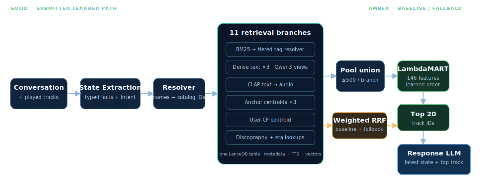
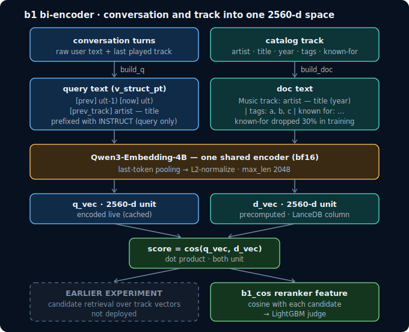

# Music-CRS Submission Architecture {#toc-and-links .title-slide .unnumbered}

::: {.eyebrow}
RecSys Challenge 2026 · Team npatta01
:::

How one conversation becomes a ranked list of 20 tracks and a natural-language response.

::: {.home-map}
[1. High-Level Architecture](#high-level-architecture) → [2. State Extraction](#state-extraction) → [3. Retrieval](#retrieval) → [4. Bi-Encoder](#bi-encoder) → [5. Ranking](#ranking) → [6. Response Generation](#response-generation)
:::

::: {.home-links}
[Examples](#examples) · [Label Audit](#label-audit) · [References](#references) · [Repository](https://github.com/npatta01/music-crs-2026) · [Paper](../paper/main.pdf)
:::

<p class="source-line">Move horizontally between sections. Scroll down inside a section for progressively deeper detail.</p>

# 1. High-Level Architecture {#high-level-architecture .title-slide}

::: {.eyebrow}
Section 1 · deployed path
:::

::: {.system-overview}
::: {.overview-input}
**Whole-system input**

Conversation, played tracks, user profile
:::
::: {.overview-system}
**Retrieve → rank → respond**

Typed state → 11 catalog queries → candidate union → LambdaMART → final ordering → response LLM
:::
::: {.overview-output}
**Output**

20 track IDs + one short recommendation
:::
:::

::: {.detail-strip}
↓ Detail: [deployed pipeline](#deployed-pipeline) · [one-turn contract](#one-turn-data-flow)
:::

## Deployed pipeline {#deployed-pipeline}

{.diagram .pipeline-diagram .nostretch fig-alt="The submission architecture: conversation and played tracks flow through state extraction and entity resolution into eleven LanceDB retrieval branches. Their pool union goes to a 146-feature LambdaMART ranker, final ordering with an exact-track pin and artist check, the top 20, and a response LLM. Weighted RRF appears separately in amber as the baseline and fallback."}

<p class="source-line">Dark adaptation of the architecture figure. The main learned path and the separate RRF baseline/fallback are visually distinguished.</p>

## One-turn data flow {#one-turn-data-flow}

::: {.contract-flow}
::: {.contract-node}
**Listener**

“Find the specific subdued Neko Case song…”
:::
::: {.contract-node}
**State**

Hidden target · Neko Case · mood/lyric/sonic clues
:::
::: {.contract-node}
**Ranking**

Candidate union → learned scores → final ordering → top 20
:::
::: {.contract-node}
**Experience**

Top track + grounded response
:::
:::

::: {.stage-contract-list}
<p class="stage-contract-title">What crosses each system boundary</p>
<div><b>State Extraction</b><span>conversation history</span><i>→</i><strong>structured, catalog-groundable state</strong></div>
<div><b>Retrieval</b><span>state + catalog</span><i>→</i><strong>candidate union</strong></div>
<div><b>Ranking</b><span>candidate rows + features</span><i>→</i><strong>learned scores + exact-track/artist guards → ordered top 20</strong></div>
<div><b>Response Generation</b><span>top 1 + latest state</span><i>→</i><strong>listener-facing response</strong></div>
:::

<p class="source-line">Sources: paper/main.tex Figure 1; final Blind-B configuration.</p>

# 2. State Extraction {#state-extraction .title-slide}

::: {.eyebrow}
Section 2 · language → retrieval contract
:::

::: {.system-overview}
::: {.overview-input}
**Input: session**

“Subdued, female singer… a sense of place… not it either.”

Earlier: Neko Case; rejected “Calling Cards” and “Man”
:::
::: {.overview-system}
**State Extraction**

Read the whole dialog → preserve facts and feedback → resolve named entities
:::
::: {.overview-output}
**Output: usable state**

Hidden target · Neko Case anchor · two rejected tracks · mood, lyric, and sonic facets
:::
:::

::: {.detail-strip}
↓ Detail: [session example](#state-session-example) · [extracted facts](#state-extraction-schema) · [retrieval view](#state-to-retrieval-view) · [resolution](#entity-resolution) · [contract](#retrieval-contract)
:::

## Session → extracted state {#state-session-example}

<div class="session-meta"><span>SESSION</span> 024a2738-a96c-4e11-adf3-b2cb8311a493 <b>· TURN 3</b></div>

::: {.conversation-to-state}
::: {.turn-timeline}
**Conversation excerpt**

<div class="turn"><i>T1</i><p><b>Listener</b> “It’s a Neko Case track.”</p></div>
<div class="turn"><i>T2</i><p><b>Previous recommendation</b> Neko Case — “Calling Cards”<br><span>Listener: “not quite it”</span></p></div>
<div class="turn current"><i>T3</i><p><b>Previous recommendation</b> Neko Case — “Man”<br><span>Listener: “Much more subdued… sense of place… stark, almost a cappella… not it either.”</span></p></div>
:::
::: {.state-code}
**Extracted state**

```json
{
  "turn": 3,
  "request_type": "hidden_target",
  "must_use_artist": "Neko Case",
  "avoid_tracks": ["Calling Cards", "Man"],
  "facets": {
    "mood": "subdued",
    "lyrics": "sense of place",
    "sonic": "stark, almost a cappella"
  }
}
```
:::
:::

<p class="source-line">Source: retained Blind-B trace, session 024a2738-a96c-4e11-adf3-b2cb8311a493, turn 3; paper/main.tex Figure 2.</p>

## Extracted facts {#state-extraction-schema}

The extractor preserves six kinds of information. This turn produced:

::: {.state-facts-map}
<div><i>◎</i><b>Current ask</b><span>Find a hidden target; keep narrowing.</span></div>
<div><i>♬</i><b>Named music</b><span>Neko Case · “Calling Cards” · “Man”</span></div>
<div><i>±</i><b>Feedback</b><span>Both previous tracks rejected.</span></div>
<div><i>◇</i><b>Constraints</b><span>Artist must remain Neko Case.</span></div>
<div><i>≈</i><b>Descriptive clues</b><span>Subdued · sense of place · almost a cappella</span></div>
<div><i>→</i><b>Search cues</b><span>Hidden-target + lyric-aware retrieval.</span></div>
:::

<p class="source-line">Code contract: mcrs/conversation_state/schema.py. Architecture: docs/architectures/session_state.md.</p>

## From extracted facts to retrieval state {#state-to-retrieval-view}

::: {.transformation-flow}
<div><i>1</i><b>Keep valid facts</b><span>Optional details can be missing without losing the whole turn.</span></div>
<div><i>2</i><b>Ground names</b><span>Match artists, tracks, albums, and tags to catalog vocabulary.</span></div>
<div><i>3</i><b>Compile search intent</b><span>Create anchors, exclusions, filters, text queries, and routing cues.</span></div>
:::

<p class="source-line">Source: docs/architectures/session_state.md `1–2.</p>

## Entity resolution {#entity-resolution}

::: {.resolver-ladder}
<div class="resolver-input"><small>LANGUAGE</small><b>“Watercolors” by Pat Metheny</b></div>
<div class="resolver-stage"><i>1</i><p><b>Normalize</b><span>case, punctuation, whitespace</span></p></div>
<div class="resolver-stage"><i>2</i><p><b>Match by entity type</b><span>artist / track / album against catalog names</span></p></div>
<div class="resolver-stage"><i>3</i><p><b>Fuzzy fallback</b><span>artist top-20 · track top-5 · cutoff 80</span></p></div>
<div class="resolver-output"><p><b class="ok">✓ Artist found</b><span>Pat Metheny → catalog artist ID</span></p><p><b class="bad">× Track not found</b><span>Watercolors remains unresolved</span></p></div>
:::

Unresolved names stay visible instead of silently becoming a different catalog item.

<p class="source-line">Source: retained Blind-B trace; resolver architecture in docs/architectures/session_state.md.</p>

## Retrieval contract {#retrieval-contract}

::: {.card-grid}
::: {.card}
**Intent**

What the listener wants now.
:::
::: {.card}
**Anchors**

Resolved artists/tracks allowed to seed candidates.
:::
::: {.card}
**Avoid**

Played items, explicit rejections, abandoned artists.
:::
::: {.card}
**Query facets**

Tags, mood, lyrics, sonic and temporal cues.
:::
::: {.card}
**Routing**

Which query shapes fit this request.
:::
::: {.card}
**Known gaps**

Facts preserved in text but absent from catalog fields.
:::
:::

<p class="source-line">The resolved state is the only state object consumed by retrieval and feature construction.</p>

# 3. Retrieval {#retrieval .title-slide}

::: {.eyebrow}
Section 3 · one catalog, many query views
:::

::: {.system-overview .retrieval-overview}
::: {.overview-input}
**Input**

Resolved intent, anchors, rejections, tags, history, user vector
:::
::: {.overview-system}
**11 active branches**

BM25 + 3 dense text + CLAP audio + 3 anchor centroids + user CF + 2 lookups
:::
::: {.overview-output}
**Output**

Union of branch pools, each truncated to 500, ready for learned ranking
:::
:::

::: {.branch-mini-map}
**Lexical** BM25/tag resolver · **Semantic** Qwen text views · **Multimodal** CLAP/SigLIP · **Behavioral** CF centroids · **Exact** catalog lookups
:::

::: {.detail-strip}
↓ Detail: [catalog](#lancedb-catalog) · [branch map](#retrieval-branches) · [lexical](#lexical-tag-retrieval) · [dense](#dense-multimodal-retrieval) · [anchors](#anchor-cf-lookups) · [candidate union](#routing-candidate-pool)
:::

## LanceDB catalog {#lancedb-catalog}

::: {.metric-grid}
::: {.metric}
**47,071**

<span>tracks</span>
:::
::: {.metric}
**1 table**

<span>shared ID namespace</span>
:::
::: {.metric}
**11**

<span>active retrieval branches</span>
:::
::: {.metric}
**metadata + vectors**

<span>FTS, text, audio, image, CF, b1</span>
:::
:::

Every branch queries the same catalog row and returns the same `track_id`, which makes union, feature joins, and replay deterministic.

::: {.north-star}
<i>◎</i><p><b>Goal not fully materialized</b><span>We wanted one catalog-grounded query plan for the listener’s complete request. In practice, retrieval split the request across branches and the ranker had to recombine their evidence.</span></p>
:::

<p class="source-line">Source: paper/main.tex `2; mcrs/qu_modules/catalog_lance.py.</p>

## Retrieval branch map {#retrieval-branches}

::: {.branch-map}
::: {.branch-source}
**Resolved state**
:::
::: {.branch-stack}
**BM25 + tag resolver**

**Dense text ×3**

**CLAP text → audio**

**Anchor centroids ×3**

**User-CF centroid**

**Discography + era lookups**
:::
::: {.branch-destination}
**Candidate union**

Track ID + branch rank + branch score + presence
:::
:::

The final learned path does **not** use the RRF order as its ranking input; it uses the union and branch evidence.

<p class="source-line">Source: paper/main.tex Figure 1 and Table 1.</p>

## Lexical and tag retrieval {#lexical-tag-retrieval}

::: {.tag-query-layout}
::: {.tag-resolver-detail}
**Free-form phrase → catalog tag**

<div class="resolver-tier"><i>1.0</i><b>Exact</b><span>normalized phrase is a catalog tag</span></div>
<div class="resolver-tier"><i>0.9</i><b>Alias</b><span>curated synonym maps to a known tag</span></div>
<div class="resolver-tier"><i>0.8</i><b>Substring</b><span>known tag appears inside the phrase</span></div>
<div class="resolver-tier"><i>≥.60</i><b>Embedding</b><span>top-3 semantic neighbors, only if lexical tiers fail</span></div>
:::
::: {.bm25-example}
<small>SIMPLIFIED BM25 CLAUSES · NEKO CASE TURN</small>

<p><code>artist_name</code><b>“Neko Case”</b><em>× 3.0</em></p>
<p><code>track_name</code><b>“subdued… sense of place…”</b><em>× 3.0</em></p>
<p><code>tag_list</code><b>resolved descriptive tags</b><em>× 1.5</em></p>

<span>Each clause is a separate SHOULD match. Rejected tracks are removed after retrieval.</span>
:::
:::

If no tag resolves, the raw phrase remains in text search so the signal is not dropped.

<p class="source-line">Source: docs/architectures/v0plus_retrieval.md; final Blind-B config.</p>

## Dense and multimodal retrieval {#dense-multimodal-retrieval}

| Query view | Catalog field searched | What it can surface |
|---|---|---|
| current request | `metadata_qwen3_embedding_8b` | artist, title, album, and broad semantic matches |
| musical attributes | `attributes_qwen3_embedding_8b` | genre, mood, style, and descriptive matches |
| lyrical theme | `lyrics_qwen3_embedding_0_6b` | lyric and narrative similarity |
| sonic description | `audio_laion_clap` | text-to-audio similarity |

The 11 modeled branches preserve their own score scales. LambdaMART receives branch-specific rank, score, margin, hit, z-score, and percentile evidence.

<p class="source-line">Source: paper/main.tex `2 and model feature names.</p>

## Anchors, CF, and lookups {#anchor-cf-lookups}

::: {.card-grid}
::: {.card}
**Liked-track audio**

CLAP centroid of positive anchors.
:::
::: {.card}
**Liked-track cover art**

SigLIP centroid.
:::
::: {.card}
**Liked-track behavior**

CF-BPR centroid.
:::
::: {.card}
**User behavior**

User-CF centroid when available.
:::
::: {.card}
**Discography**

Resolved artist → catalog tracks.
:::
::: {.card}
**Era**

Popularity lookup within the requested period.
:::
:::

<p class="source-line">Source: paper/main.tex Table 1; final Blind-B config.</p>

## Routing and candidate union {#routing-candidate-pool}

::: {.contract-flow .three}
::: {.contract-node}
**Route**

Request flags shape query text and enable gated branches.
:::
::: {.contract-node}
**Union**

Deduplicate branch top-500 lists while retaining provenance.
:::
::: {.contract-node}
**Handoff**

Build one candidate row with catalog, state, branch, and embedding evidence.
:::
:::

Weighted RRF over the same branches remains available as an explicit no-training baseline and fallback; the deployed LambdaMART path replaces its final order.

<p class="source-line">Source: paper/main.tex Figure 1 and Results Table 3.</p>

# 4. Bi-Encoder {#bi-encoder .title-slide}

::: {.eyebrow}
Section 4 · conversation ↔ track similarity
:::

::: {.system-overview}
::: {.overview-input}
**Input**

Compact conversation rendering + a candidate track card
:::
::: {.overview-system}
**Shared encoder**

Fine-tuned Qwen3-Embedding-4B → two 2560-d unit vectors → cosine
:::
::: {.overview-output}
**Output**

`b1_cos`, one candidate feature used by LambdaMART
:::
:::

The bi-encoder was **feature-only** in the submitted path, not a candidate-producing branch.

::: {.detail-strip}
↓ Detail: [architecture](#biencoder-architecture) · [actual example](#biencoder-example) · [training](#biencoder-training) · [serving](#biencoder-serving) · [evidence](#biencoder-evidence)
:::

## Two-tower architecture {#biencoder-architecture}

{.diagram .biencoder-diagram .nostretch fig-alt="A conversation rendering and a candidate track card pass through one shared fine-tuned Qwen3 embedding encoder. Last-token pooling and normalization create two unit vectors, whose cosine becomes the b1_cos ranking feature."}

<p class="source-line">Source: paper/main.tex Figure 3; docs/architectures/biencoder.md.</p>

## Actual rendered pair {#biencoder-example}

<div class="session-meta"><span>SESSION</span> 024a2738-a96c-4e11-adf3-b2cb8311a493 <b>· TURN 3</b></div>

::: {.encoder-pair}
::: {.encoder-conversation}
**Conversation rendering**

<p><span class="render-key">[prev]</span> “Calling Cards is not quite it”</p>
<p><span class="render-key">[now]</span> “More subdued… sense of place… stark almost a cappella”</p>
<p><span class="render-key">[prev_track]</span> Neko Case — “Man”</p>
:::
::: {.cosine-mark}
<span>same<br>encoder</span>
<b>cos</b>
:::
::: {.track-record}
<div class="record-disc">♪</div>
<div>
<small>TRACK RENDERING</small>
<h3>Bracing For Sunday</h3>
<p><b>Neko Case</b></p>
<p><span class="render-key">album</span> The Worse Things Get, The Harder I Fight, The Harder I Fight, The More I Love You</p>
<p><span class="render-key">year</span> unavailable; catalog tag: 2013</p>
<p class="tag-line"><em>alt-country</em><em>female vocalists</em><em>indie rock</em></p>
</div>
:::
:::

<p class="known-for"><b>Artist context:</b> Neko Case is best known for her alt-country and indie rock style, characterized by her powerful voice and poetic lyrics.</p>

<p class="source-line">Conversation/track formats: docs/architectures/biencoder.md. Track selected in retained Blind-B Neko Case trace.</p>

## Training data and objective {#biencoder-training}

::: {.metric-grid}
::: {.metric}
**53,885**

<span>positive conversation–track pairs</span>
:::
::: {.metric}
**4 hard negatives**

<span>per positive</span>
:::
::: {.metric}
**2560-d**

<span>normalized vectors</span>
:::
::: {.metric}
**MNRL**

<span>contrastive ranking loss</span>
:::
:::

<p class="source-line">Source: paper/main.tex `2.4; docs/architectures/biencoder.md.</p>

## Serving {#biencoder-serving}

::: {.contract-flow .three}
::: {.contract-node}
**Offline**

Precompute all 47,071 track vectors into LanceDB.
:::
::: {.contract-node}
**Per turn**

Encode and cache one conversation vector.
:::
::: {.contract-node}
**Per candidate**

Dot product with cached track vector → `b1_cos`.
:::
:::

<p class="source-line">Source: docs/architectures/biencoder.md `Serving.</p>

## Measured ranking gain {#biencoder-evidence}

::: {.biencoder-lift}
<div><small>WITHOUT BI-ENCODER FEATURE</small><b>0.1970</b><span>OOF nDCG@20</span></div>
<i>→</i>
<div class="lift-result"><small>WITH <code>b1_cos</code></small><b>0.2032</b><span>OOF nDCG@20</span></div>
<strong>+0.0062</strong>
:::

The deployed ranker kept `b1_cos` as one candidate-level similarity feature.

<p class="source-line">Source: paper/main.tex Tables 2–3. Development evidence only.</p>

# 5. Ranking {#ranking .title-slide}

::: {.eyebrow}
Section 5 · candidate evidence → ordered top 20
:::

::: {.system-overview .ranking-overview}
::: {.overview-input}
**Input**

Candidate union: up to 500 per branch + 146 features per turn–track pair
:::
::: {.overview-system}
**Learned scoring**

LambdaMART learns one score per candidate within the turn

<span class="mini-gain"><b>b1 cosine 59.0%</b> · branch 11.5% · affinity 10.7% · other cosine 8.9%</span>
:::
::: {.overview-output}
**Final ordering**

Exact-track pin + final artist check → ordered top 20
:::
:::

::: {.detail-strip}
↓ Detail: [inference contract](#ranking-input) · [feature gain](#ranking-feature-gain) · [sample features](#ranking-sample-features) · [training labels](#lambdamart-training)
:::

## Inference-time ranking {#ranking-input}

::: {.ranking-inference-flow}
<div><small>PHASE 1 · CANDIDATE EVIDENCE</small><b>One row per track</b><span>candidate union + state + branch evidence + catalog and embedding matches</span></div>
<i>→</i>
<div><small>PHASE 2 · LEARNED SCORING</small><b>LambdaMART</b><span>one score for every candidate; compared within this conversation turn</span></div>
<i>→</i>
<div class="ranking-output"><small>PHASE 3 · FINAL ORDERING</small><b>Score order → two guards → top 20</b><span>exact-track pin + final artist check, then return ordered track IDs</span></div>
:::

<div class="ranking-field-boundary"><span><b>Used at inference</b>conversation state · branch ranks/scores · catalog metadata · embeddings · played/rejected history</span><span class="excluded"><b>Not used</b>conversation-goal fields</span></div>

Candidates are compared only against other candidates from the same conversation turn.

<p class="source-line">Source: models/reranker_v12_goalfree/model.txt; scripts/rerank/features.py.</p>

## Feature gain in the deployed model {#ranking-feature-gain}

::: {.gain-bars}
::: {.gain-row style="--gain:59"}
<span>Bi-encoder cosine</span><i></i><b>59.0%</b>
:::
::: {.gain-row style="--gain:11.5"}
<span>Per-branch rank/score</span><i></i><b>11.5%</b>
:::
::: {.gain-row style="--gain:10.7"}
<span>Session/artist affinity</span><i></i><b>10.7%</b>
:::
::: {.gain-row style="--gain:8.9"}
<span>Other similarity cosines</span><i></i><b>8.9%</b>
:::
::: {.gain-row style="--gain:5"}
<span>Popularity</span><i></i><b>5.0%</b>
:::
:::

Remaining families: state/intent 2.2%, tag/lexical overlap 2.0%, constraints/rejections 0.7%.

<p class="source-line">Source: paper/main.tex Table 2; gain recomputed from the deployed model.</p>

## Sample features {#ranking-sample-features}

| Family | Concrete checked-in features |
|---|---|
| branch evidence | `rank__bm25`, `margin__dense…metadata`, `hit__lookup…discography` |
| semantic match | `b1_cos`, `msg_meta_cos`, `q06_lyric_cos`, `clap_centroid` |
| session/artist | `same_artist_last`, `same_album_any`, `artist_played_count` |
| catalog | `pop_pct`, `within_artist_pop`, `release_year`, `tag_count` |
| request/state | `request_type`, `intent_mode`, `wants_new_artist`, `year_in_constraint` |
| constraints | `rejected_track_exact`, `rejected_artist_exact`, `violates_new_artist` |

<p class="source-line">Source: models/reranker_v12_goalfree/model.txt feature_names.</p>

## LambdaMART training and label weights {#lambdamart-training}

::: {.contract-flow .three}
::: {.contract-node}
**Binary relevance**

The challenge next track is the positive row.
:::
::: {.contract-node}
**Targeted downweights**

×0.3 if next turn rejects the track or says it did not help; ×0.6 for artist-only rejection.
:::
::: {.contract-node}
**LambdaRank**

User-grouped CV; final model fit on all 8,000 development turns.
:::
:::

We also trained a model on fully rejudged labels. It performed worse on development data, so we did not ship it. The shipped model used the targeted downweights above.

<p class="source-line">Source: paper/main.tex `2.3; scripts/rerank/build_label_weights.py and train_lgbm.py.</p>

# 6. Response Generation {#response-generation .title-slide}

::: {.eyebrow}
Section 6 · selected track → listener-facing text
:::

::: {.system-overview}
::: {.overview-input}
**Inputs**

Latest extracted state + selected top track + catalog metadata
:::
::: {.overview-system}
**Single pass**

XML item card → Qwen3-30B-A3B-Instruct, temperature 0
:::
::: {.overview-output}
**Output**

1–2 concise sentences about only the selected track
:::
:::

The generator presents the ranking decision; it cannot replace the selected track.

<p class="opener-note"><b>Response-only experiment:</b> changing the text generation setup improved the organizer judge score from 4.20 to 4.70 while recommendations stayed fixed.</p>

::: {.detail-strip}
↓ Detail: [actual example](#response-example) · [input contract](#response-inputs) · [prompt](#response-prompt)
:::

## Actual input → response {#response-example}

<div class="session-meta"><span>SESSION</span> 024a2738-a96c-4e11-adf3-b2cb8311a493 <b>· TURN 3</b></div>

::: {.response-story}
::: {.response-source .state-source}
<span>STATE</span>

<div class="state-field-list compact">
<div><code>current_request.request_type</code><b>hidden_target</b></div>
<div><code>facts[].artist</code><b>Neko Case · must use</b></div>
<div><code>facts[].mood</code><b>subdued</b></div>
<div><code>facts[].lyrical_theme</code><b>sense of place</b></div>
<div><code>facts[].sonic</code><b>stark · almost a cappella</b></div>
</div>
:::
::: {.response-source .track-source}
<span>TOP 1</span>

**Neko Case — “Bracing For Sunday”**
:::
::: {.response-copy}
<span>SUBMITTED RESPONSE</span>

“You’re looking for something subdued with a strong sense of place and a stark, almost a cappella delivery—and *Bracing For Sunday* fits that mood perfectly. Neko Case’s haunting, intimate vocals carry the weight of a quiet, specific moment, like a solitary figure in a weathered room, making the song feel both deeply personal and grounded in a distinct place.”
:::
:::

<p class="source-line">Source: retained Blind-B output; paper/main.tex Figure 2.</p>

## Input contract {#response-inputs}

::: {.input-streams}
::: {.input-stream .state-stream}
<i>S</i><div><b>Latest state</b><span>request · facts · constraints · rejections</span></div>
:::
::: {.input-stream .top-stream}
<i>#1</i><div><b>Top 1</b><span>the ranker’s selected track · immutable here</span></div>
:::
::: {.input-stream .music-stream}
<i>♪</i><div><b>Track metadata</b><span>artist · title · album · year · up to 10 tags</span></div>
:::
::: {.input-stream .xml-stream}
<i>&lt;/&gt;</i><div><b>Formatting</b><span>delimited XML item block</span></div>
:::
<div class="generator-core"><i>◇</i><small>GENERATOR</small><b>Qwen3-30B-A3B</b><span>temperature 0 · no echo retries</span></div>
:::

<p class="source-line">Source: final Blind-B config; docs/architectures/explanation_generation.md.</p>

## Deployed prompt {#response-prompt}

<div class="prompt-stack"><div class="prompt-label">SYSTEM INSTRUCTIONS</div><pre class="prompt-copy"><code>You are an expert music recommendation assistant. Your task is to understand user preferences and provide personalized music recommendations.

You are the conversational voice of a music recommender — a "track explainer." A separate recommendation system has ALREADY selected one track to play next. Your only job is to write the short listener-facing message that presents that track: acknowledge what the listener just asked, then naturally explain why this track fits their request and taste.

Guidelines:
- Output ONLY the listener-facing message — no labels, headers, quotes, or YAML.
- Brief and conversational: 1-2 concise sentences. Match the listener's tone, energy, and LANGUAGE (reply in the same language they wrote in).
- Ground the "why it fits" in their request/stated taste. You MAY name the title/artist, but do NOT recite a metadata or tag dump (genre/mood/style lists) unless they asked for those details.
- If the track clearly doesn't match, briefly and honestly acknowledge the mismatch — don't oversell.
- Vary your wording across turns. Use only facts supported by the provided track; invent nothing.
- The track may be provided as structured &lt;recommended_track&gt; data. NEVER output that data, the tag list, or any XML verbatim — always write a natural conversational sentence.</code></pre>
<div class="prompt-label prompt-style">STYLE INSTRUCTIONS</div><pre class="prompt-copy prompt-style"><code>Prioritize the latest user request and extracted state over older conversation history.
If the track is reasonably aligned, explain the fit with one specific supported reason.
If it clearly conflicts with an explicit avoid/new-artist constraint, do not oversell it or blame the system; briefly frame the limitation and the closest supported reason.</code></pre>
<div class="prompt-label prompt-runtime">RUNTIME INPUT · appended per turn</div><div class="runtime-injection"><div><small>LISTENER CONTEXT</small><b>latest request + extracted state</b><span>Neko Case · subdued · sense of place · two rejected tracks</span></div><div><small>SELECTED TRACK XML</small><b>Neko Case — “Bracing For Sunday”</b><span>album · year · tags</span></div></div></div>

<p class="source-line">Source: deployed response template quoted in paper/main.tex `2.5.</p>

# 7. Examples {#examples .title-slide}

::: {.eyebrow}
Section 7 · traces across the full system
:::

::: {.system-overview}
::: {.overview-input}
**Input evidence**

Four retained Blind-B listener requests and their extracted states
:::
::: {.overview-system}
**Trace view**

Session → state → resolved constraints → top predictions → response
:::
::: {.overview-output}
**Output insight**

One success; three distinct architectural failure boundaries
:::
:::

::: {.detail-strip}
↓ Cases: [Neko Case](#example-neko-case) · [Kamelot](#example-kamelot) · [missing metadata](#example-metadata) · [Watercolors](#example-watercolors)
:::

## Success: Neko Case {#example-neko-case}

<div class="session-meta"><span>SESSION</span> 024a2738-a96c-4e11-adf3-b2cb8311a493 <b>· TURN 3</b></div>

::: {.trace-grid .trace-strips}
::: {.trace-cell}
**Session**

“Subdued… female singer… sense of place… stark almost a cappella… not it either.”
:::
::: {.trace-cell}
**Compiled state**

<div class="state-field-list compact">
<div><code>current_request.request_type</code><b>hidden_target</b></div>
<div><code>facts[].artist</code><b>Neko Case · must use</b></div>
<div><code>exclusions[].track</code><b>Calling Cards · Man</b></div>
<div><code>facts[].lyrical_theme</code><b>sense of place</b></div>
<div><code>routing.lyric_search</code><b>true</b></div>
</div>
:::
::: {.trace-cell .top-five}
**Top 5**

<ol class="ranked-tracks"><li class="selected">Bracing For Sunday <em>Selected Top 1</em></li><li>Maybe Sparrow</li><li>I Wish I Was the Moon</li><li>Lady Pilot</li><li>Lion’s Jaws</li></ol>

<small class="rank-legend"><i></i> Selected Top 1 <i></i> Ranks 2–5 · not independently judged</small>
:::
:::

All five are Neko Case; the top track and response preserve the request’s concrete clues.

<p class="source-line">Source: retained Blind-B trace/output, session 024a… turn 3.</p>

## Constraint lost: Kamelot album {#example-kamelot}

::: {.failure-story .kamelot-story}
::: {.failure-request}
<small>LISTENER REQUEST</small>

“The Kamelot track from **Silverthorn**…”
:::
::: {.failure-state}
<div><small>EXTRACTED STATE</small><b class="ok"><code>facts[].artist</code> Kamelot</b><b class="ok"><code>facts[].album</code> Silverthorn</b></div>
<div><small>RETRIEVAL QUERY</small><b class="ok"><code>resolved.artist</code> Kamelot</b><b class="bad"><code>album_filter</code> missing</b></div>
:::
::: {.failure-ranking}
<small>TOP 5 · ALL VIOLATE THE ALBUM CONSTRAINT</small>

<ol><li>Fallen Star <em>Haven</em></li><li>This Pain <em>The Black Halo</em></li><li>Moonlight <em>The Black Halo</em></li><li>Soul Society <em>The Black Halo</em></li><li>The Haunting <em>The Black Halo</em></li></ol>
:::
:::

The state understood the album. Retrieval and ranking did not enforce it.

<p class="source-line">Source: retained Blind-B trace/output, session 5c066e… turn 2.</p>

## Missing metadata: extracted but unenforceable {#example-metadata}

::: {.metadata-cases}
::: {.metadata-case .bpm-case}
<div class="session-meta"><span>SESSION</span> bf27c872-87df-46f0-8e4d-328d11baec30 <b>· TURN 8</b></div>

::: {.metadata-story}
<div class="story-request"><small>REQUEST</small><p>“An aggressive metal/hardcore track that exactly matches <b>126.70 BPM</b> and <b>G minor</b>.”</p></div>
<div class="story-state"><small>EXTRACTED STATE</small><p><code>facts[].facet=sonic</code><br><b class="ok">✓ 126.70 BPM · G minor</b></p></div>
<div class="story-gap"><small>CATALOG BOUNDARY</small><p><b class="bad">× No BPM or key fields</b><br>No executable filter could be created.</p></div>
<div class="story-output"><small>OBSERVED OUTPUT</small><p>Top 1: Kreator — “Extreme Aggression”<br><b class="bad">Response asserted the exact BPM/key without evidence.</b></p></div>
:::
:::
::: {.metadata-case .soundtrack-case}
<div class="session-meta"><span>SESSION</span> b26791c3-ceaf-4de8-9c9a-7b2db7163e60 <b>· TURN 5</b></div>

::: {.metadata-story}
<div class="story-request"><small>REQUEST</small><p>“The 80s synth-pop track used in a <b>Breaking Bad</b> montage…”</p></div>
<div class="story-state"><small>EXTRACTED STATE</small><p><code>current_request.summary</code><br><b class="ok">✓ soundtrack · montage</b><br><code>facts[].genre</code> 80s synth-pop</p></div>
<div class="story-gap"><small>CATALOG BOUNDARY</small><p><b class="bad">× No film/TV soundtrack field</b><br>No authoritative target could be resolved.</p></div>
<div class="story-output"><small>OBSERVED OUTPUT</small><p>Top 1: Soft Cell — “Tainted Love”<br><b class="bad">Response asserted soundtrack fit without evidence.</b></p></div>
:::
:::
:::

<p class="source-line">Source: retained Blind-B traces bf27… turn 8 and b267… turn 5; catalog schema.</p>

## Exact-track request recognized, but Watercolors was not found {#example-watercolors}

<div class="session-meta"><span>SESSION</span> 954de66b-4f3a-4cc7-8e93-f58c2b6e64b9 <b>· TURN 2</b></div>

::: {.watercolors-story}
::: {.watercolors-request}
<small>EXACT REQUEST</small>

“I wanted **‘Watercolors’ by Pat Metheny** specifically.”
:::
::: {.match-status}
<div class="match-ok"><i>✓</i><p><b>Artist exact match</b><span>Pat Metheny exists in the catalog.</span></p></div>
<div class="match-bad"><i>×</i><p><b>Track not found</b><span>No catalog track matched “Watercolors.”</span></p></div>
:::
::: {.watercolors-output}
<small>TOP 1 + SUBMITTED RESPONSE</small>

<p><b>Pat Metheny — “Alfie”</b></p>
<blockquote>“Got it — here’s \"Alfie\" by Pat Metheny, a smooth, introspective piece from his <em>What’s It All About</em> album…”</blockquote>
:::
:::

The artist match produced substitutes, while the response sounded as if the exact request had been fulfilled.

<p class="source-line">Source: retained Blind-B trace/output, session 954de6… turn 2.</p>

# 8. Label Audit {#label-audit .title-slide}

::: {.eyebrow}
Section 8 · request fit of the training target
:::

::: {.system-overview}
::: {.overview-input}
**Problem observed**

Our model kept returning the same artist after listeners asked to move on.
:::
::: {.overview-system}
**Question**

Was the model learning that behavior from the challenge’s next-track labels?
:::
::: {.overview-output}
**Audit**

Rejudge request fit and artist anchoring; test a cleaner-label model.
:::
:::

<p class="audit-motivation"><b>Why we did this:</b> anchoring appeared in our recommendations, and the training target sometimes rewarded the same behavior.</p>

::: {.detail-strip}
↓ Detail: [Bonobo example](#label-bonobo) · [judge flow](#label-judging-flow) · [counts](#label-audit-counts) · [outcome](#label-outcome-limitations)
:::

## Training-label failure examples {#label-bonobo}

<div class="session-meta"><span>SESSION</span> 016099ac-567c-4cd7-81f5-d385be38a4bc</div>

::: {.anchor-timeline}
<div class="anchor-step history"><i>T1</i><p><b>Previously played</b><br>Bonobo — “Antenna”</p></div>
<div class="anchor-step history"><i>T2</i><p><b>Previously played</b><br>Bonobo — “Cirrus”</p></div>
<div class="anchor-step conflict"><i>T3</i><p><b>Listener</b><br>“Similar chill, electronic vibe… but <strong>from a different artist</strong>?”</p><p><b>Ground truth</b><br>Bonobo — “Jets” <mark>MOVES toward goal</mark></p></div>
<div class="anchor-step conflict"><i>T4</i><p><b>Listener</b><br>“‘Jets’ is cool, but… <strong>a different artist this time</strong>…”</p><p><b>Ground truth</b><br>Bonobo — “Pieces” <mark>MOVES toward goal</mark></p></div>
:::

The ground truth repeats the artist the listener explicitly asked to leave.

::: {.second-anchor-example}
<small>ANOTHER RELEASED TRAINING EXAMPLE</small>
<p><b>Listener:</b> “Could you suggest some <strong>other artists</strong>… with a similar acoustic folk sound?”</p>
<p><b>Played label:</b> Kings of Convenience — “Singing Softly To Me” <mark>same artist · originally liked</mark></p>
<p><b>Audit:</b> artist anchoring → <span>NEGATIVE</span></p>
:::

::: {.constraint-audit-example}
<small>CONSTRAINT EXAMPLE</small><p><b>Asked:</b> slow, smooth <strong>90s R&amp;B</strong></p><p><b>Played label:</b> Post Malone — “Broken Whiskey Glass” <mark>2016 · wrong genre/era</mark></p><p><b>Audit:</b> request mismatch → <span>NEGATIVE</span></p>
:::

<p class="source-line">Source: paper/main.tex Figure 4.</p>

## Two-judge and arbitration flow {#label-judging-flow}

::: {.audit-flow}
::: {.audit-node}
**Turn + candidate label**

Request, context, played track
:::
::: {.audit-split}
::: {.audit-node}
<i class="model-icon">G</i> **Gemma-4-26B**

request fit + anchoring
:::
::: {.audit-node}
<i class="model-icon">D</i> **DeepSeek-V4-Flash**

request fit + anchoring
:::
:::
::: {.audit-node .audit-gate}
**Conflict gate**

Agree → keep<br>Disagree → send to Opus
:::
<div class="audit-node audit-output"><small>DISAGREEMENT ONLY</small><p class="model-name"><i class="model-icon">O</i><b>Claude Opus</b></p><p>Final label, blind to synthetic reaction</p></div>
:::

<p class="source-line">Source: data/anchor_labels_v1 reports/flow.html and reproducible release scripts.</p>

## Audit counts {#label-audit-counts}

::: {.metric-grid}
::: {.metric}
**113,393**

<span>train + dev turns judged</span>
:::
::: {.metric}
**106,393**

<span>training turns</span>
:::
::: {.metric}
**61,063**

<span>negative labels (57.4%)</span>
:::
::: {.metric}
**18,222**

<span>artist-anchoring negatives</span>
:::
:::

After fixing the conflict gate, **3,486 additional disagreements** were sent to Opus. The correction reduced the anchoring count from **19,813 to 18,222**.

<p class="source-line">Source: data/anchor_labels_v1/README.md and DATASET_CARD.md.</p>

## What shipped {#label-outcome-limitations}

::: {.ship-decision}
<div class="tested"><small>WE TESTED</small><b>Fully rejudged labels</b><span>Train an alternative reranker on the released audit labels.</span></div>
<div class="decision"><i>×</i><p><b>It performed worse on development data, so we did not ship it.</b><span>The audit remains useful evidence, but it did not improve our model.</span></p></div>
<div class="shipped"><small>WE SHIPPED</small><b>Original target + targeted downweights</b><span>×0.3 for clear rejection / no progress; ×0.6 for artist-only rejection.</span></div>
:::

<p class="source-line">Source: paper/main.tex `4.2; scripts/rerank/build_label_weights.py.</p>

# 9. References {#references .title-slide}

::: {.eyebrow}
Section 9 · source index
:::

::: {.reference-grid}
::: {.reference-card}
**Paper**

[Paper PDF](../paper/main.pdf)

[Readable Markdown](../paper/draft.md)
:::
::: {.reference-card}
**Submission audits**

[Blind-A prediction audit](../reports/blindset-a-prediction-audit/index.html)

[Blind-B prediction audit](../reports/blindset-b-prediction-audit/index.html)
:::
::: {.reference-card}
**Retrospective**

[Interactive retrospective](retrospective.html)

[Challenge](https://nlp4musa.github.io/music-crs-challenge/)
:::
::: {.reference-card}
**Code and data**

[Repository](https://github.com/npatta01/music-crs-2026)

[Label data](../data/anchor_labels_v1/README.md)
:::
:::

Architecture details: [State](architectures/session_state.md) · [Retrieval](architectures/v0plus_retrieval.md) · [Bi-Encoder](architectures/biencoder.md) · [Ranking reproduction](reproduce_reranker.md) · [Response Generation](architectures/explanation_generation.md)

<p class="source-line">Blind-A and Blind-B appear here as audit references only; the deck documents one final submission architecture.</p>
