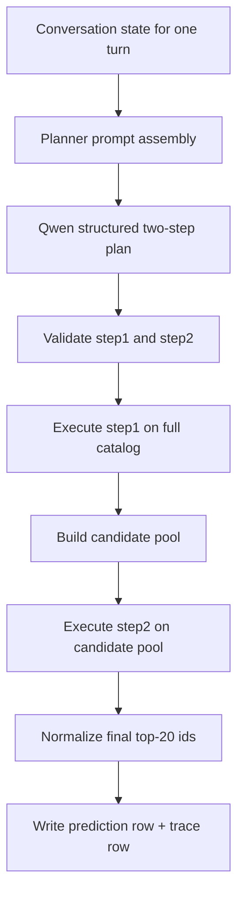
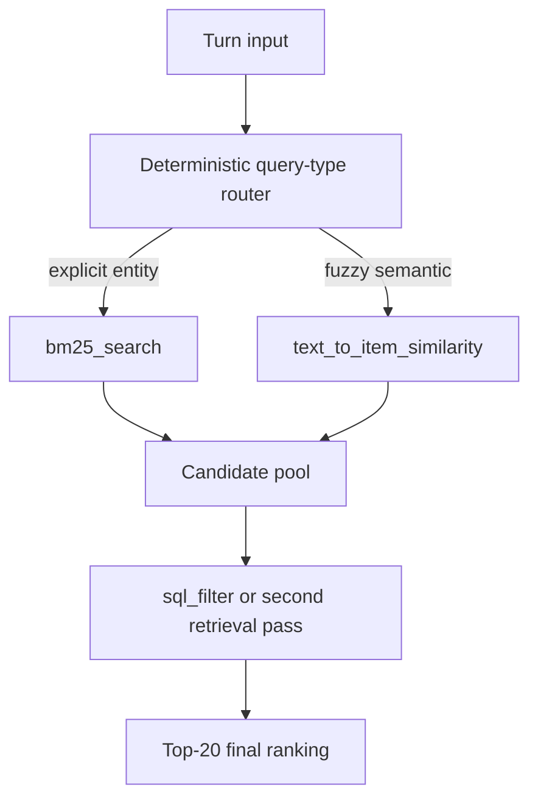

# Agentic Hardened Top-20 Design

**Status:** `analyzed`  
**Date:** 2026-05-06  
**Primary run:** `talkplay_openrouter_qwen35_9b_agentic_hardened_devset_full`

## Purpose

This document explains the current hardened agentic retrieval design that was run successfully on the full devset with:

- `1000` sessions
- `8000` turns
- `0` fallbacks
- `0` repairs

The focus here is not that this is the best retrieval system. It is not. The focus is that this is the first full-devset agentic path in this branch that is operationally stable enough to run end to end while preserving a real tool-driven planning contract.

This package is meant to answer:

- what the current agentic system actually does
- how the planner, tools, and runtime interact
- what was hardened to make it reliable
- why it is still slow
- why quality is still much worse than the current best baselines
- what the highest-ROI next changes are

## Scope

This document describes the implemented path centered on:

- [mcrs/agentic.py](/Users/npatta01/data/projects/music-conversational-music-recomender-2026/mcrs/agentic.py)
- [mcrs/retrieval_modules/litellm_embedding.py](/Users/npatta01/data/projects/music-conversational-music-recomender-2026/mcrs/retrieval_modules/litellm_embedding.py)
- [config/talkplay_openrouter_qwen35_9b_agentic_hardened_devset_full.yaml](/Users/npatta01/data/projects/music-conversational-music-recomender-2026/config/talkplay_openrouter_qwen35_9b_agentic_hardened_devset_full.yaml)
- [run_inference_devset.py](/Users/npatta01/data/projects/music-conversational-music-recomender-2026/run_inference_devset.py)
- [evaluator/evaluate_devset.py](/Users/npatta01/data/projects/music-conversational-music-recomender-2026/evaluator/evaluate_devset.py)

It does not describe the older pre-hardening `submit_ranking` flow except where useful for comparison.

## Design Summary

The current system is a **two-step structured-output planner** over a **top-20 retrieval contract**:

1. the planner emits a first retrieval step over the full catalog
2. the planner emits a second reranking/filtering step over the candidate pool from step 1
3. the runtime executes both steps locally
4. the runtime normalizes the final ranked list to exactly `20` track ids

Important design choices:

- The planner uses one model: `openai/qwen3.5-9b`
- The planner returns a **structured two-step plan**, not free-form text
- The tool surface is real retrieval/filter tools, not a dummy terminal ranking tool
- The final output depth is fixed to `20`
- The evaluator now supports shallow top-20 runs directly
- One bounded structured repair exists for malformed/invalid plans

This is a **submission-style** or **top-20 stable runtime** design, not a **deep 1000-candidate diagnostic retrieval** design.

## System Components

### Planner

The planner is configured in [config/talkplay_openrouter_qwen35_9b_agentic_hardened_devset_full.yaml](/Users/npatta01/data/projects/music-conversational-music-recomender-2026/config/talkplay_openrouter_qwen35_9b_agentic_hardened_devset_full.yaml):

- `planner_backend: litellm_chat_completions`
- `planner_model_name: openai/qwen3.5-9b`
- `planner_protocol: structured_two_step_plan`
- `planner_max_tokens: 8192`
- `temperature: 0.0`

The planner is asked to emit a structured object with:

- `step1`
- `step2`

Each step contains:

- `tool_name`
- `arguments`

### Tool Inventory

The active tools are:

- `sql_filter`
- `bm25_search`
- `text_to_item_similarity`
- `item_to_item_similarity`
- `user_to_item_similarity`

These tools are not symmetric in cost:

- `sql_filter`: cheap local SQLite filtering/reranking
- `bm25_search`: cheap local sparse retrieval
- `text_to_item_similarity`: expensive relative to the others because each query needs a remote embedding call
- `item_to_item_similarity`: local dense lookup over cached item embeddings
- `user_to_item_similarity`: local dense lookup over cached user embeddings

### Runtime

The runtime is responsible for:

- validating tool plans
- executing both steps locally
- enforcing that step 2 operates on step 1’s pool
- normalizing the final ranking to `20`
- falling back only if the planner path cannot be repaired safely

The runtime does **not** let the model invent a free-form final ranking payload anymore.

### Evaluator

The devset evaluator was relaxed so top-20 runs score cleanly:

- supported cutoffs are scored
- unsupported deeper cutoffs are `N/A`
- `min_pool_depth` / `max_pool_depth` are reported explicitly

For this run:

- `min_pool_depth = 20`
- `max_pool_depth = 20`
- deep metrics beyond `20` are intentionally unavailable

## End-to-End Flow

### Turn-Level Flow

### More Concrete Step Semantics

#### Step 1: Full-catalog retrieval

The first step is supposed to do recall work:

- `bm25_search` for explicit entities and lexical requests
- `text_to_item_similarity` for fuzzy mood/vibe/instrumentation requests
- `item_to_item_similarity` when there is a strong seed track
- `user_to_item_similarity` when profile signal is useful

#### Step 2: Pool-restricted reranking or filtering

The second step is supposed to narrow or reorder the step-1 pool:

- `sql_filter` is the dominant second-stage tool
- step 2 is not allowed to introduce ids outside the current pool

In practice, the most common successful pattern was:

- `text_to_item_similarity -> sql_filter`

The main cheaper alternative was:

- `bm25_search -> sql_filter`

## Current Operational Flow

### Sharding Strategy

The full devset run was executed as:

- `40` shards
- `25` sessions per shard
- `4` shards in parallel per wave

This was used because:

- the user wanted health checks and bounded local load
- the laptop could handle `4` local shards comfortably
- shard-level monitoring made failures easy to isolate

### Full-Run Result

The full successful result is:

- [predictions](/Users/npatta01/data/projects/music-conversational-music-recomender-2026/exp/inference/devset/talkplay_openrouter_qwen35_9b_agentic_hardened_devset_full.json)
- [trace](/Users/npatta01/data/projects/music-conversational-music-recomender-2026/exp/inference/devset/talkplay_openrouter_qwen35_9b_agentic_hardened_devset_full_trace.json)
- [score](/Users/npatta01/data/projects/music-conversational-music-recomender-2026/exp/scores/devset/talkplay_openrouter_qwen35_9b_agentic_hardened_devset_full.json)

Operational result:

- `1000` sessions
- `8000` turns
- `0` fallbacks
- `0` repairs

This is the strongest result of this design so far.

## Hardening Changes That Mattered

### 1. Structured two-step planner output

Native multi-tool calling with qwen was less reliable. The structured two-step plan path was more stable.

Why it mattered:

- fewer malformed tool-call payloads
- fewer incomplete plans
- explicit validation boundary before execution

### 2. One bounded structured repair

The runtime allows one structured retry if:

- the initial plan is malformed
- or validation/execution fails in a recoverable way

Why it mattered:

- catches occasional planner formatting failures
- keeps reliability high without unbounded loops

### 3. SQL validation and stronger planner guidance

`sql_filter` was constrained to valid `tracks`-table filtering with explicit rules around:

- allowed columns
- projection shape
- no fake identifiers
- no `topk` embedded into SQL text

Why it mattered:

- earlier qwen plans occasionally emitted broken SQL
- validation plus stricter prompt guidance reduced those failures materially

### 4. Proxy-visible model naming

The planner and embedding paths were standardized to proxy-visible names such as:

- `openai/qwen3.5-9b`
- `openai/text-embedding-3-small`

Why it mattered:

- earlier runs failed for route/model naming reasons unrelated to retrieval logic

### 5. Shallow-depth devset scoring

The evaluator change was required because this path is intentionally top-20.

Why it mattered:

- full devset top-20 runs can now be scored directly
- deep metrics no longer block iteration

## Why It Is Still Slow

The dominant latency is not local nearest-neighbor search.

The dense retrieval implementation in [mcrs/retrieval_modules/litellm_embedding.py](/Users/npatta01/data/projects/music-conversational-music-recomender-2026/mcrs/retrieval_modules/litellm_embedding.py) does:

1. remote query embedding with `client.embeddings.create(...)`
2. local exact dense scoring with `torch.matmul(self.embeddings, query_emb)`

The expensive part is mostly the remote embedding call, not the dot product.

That means:

- HNSW or IVF Flat would not be the biggest speedup for this repo right now
- approximate ANN could help somewhat, but it is not the main bottleneck at `~47k` tracks

The main reasons the run is slow are:

- many turns use `text_to_item_similarity`
- each `text_to_item_similarity` call embeds the query remotely
- planner calls are still one turn at a time inside each shard
- `planner_max_tokens=8192` is reliability-friendly but latency-heavy

## Why Quality Is Still Poor

The quality result is weak:

- `NDCG@20 = 0.0262`
- `Hit@20 = 0.0494`

That is far below the best tracked baselines.

### Comparison To Best So Far

| Run | NDCG@20 | Gap vs qwen agentic |
|---|---:|---:|
| `bm25_qu_llmrewrite_gemma4_e2b_carryover_guard_v3_devset` | 0.1092 | +0.0830 |
| `dense_qwen3_embedding_8b_devset` | 0.1025 | +0.0763 |
| `bm25_devset_retrieval_only_with_tag_list` | 0.0970 | +0.0708 |
| `llama1b_bm25_devset` | 0.0815 | +0.0553 |
| `talkplay_openrouter_qwen35_9b_agentic_hardened_devset_full` | 0.0262 | baseline |

### Most Likely Reasons

#### 1. Too much semantic retrieval

The stable tool pattern is mostly:

- `text_to_item_similarity -> sql_filter`

This is reliable, but likely too dependent on semantic retrieval for requests where simple lexical/entity search would be stronger.

#### 2. Pool depth is too shallow

This path retrieves and returns only `20`.

That is fine for a submission-style contract, but it leaves almost no room for:

- candidate recall mistakes
- second-stage reranking recovery

#### 3. The current second stage is mostly narrowing, not powerful reranking

`sql_filter` is a good constraint tool, but it is not a learned reranker and does not add new semantic power.

#### 4. The planner is optimized for valid tool use, not retrieval quality

Most of the recent work improved:

- tool compliance
- structured output correctness
- no-fallback execution

That solved stability, but not relevance.

## Recommended Future Direction

### Highest-ROI quality work

#### 1. Bias toward `bm25_search -> sql_filter` for explicit entities

Use semantic retrieval only when lexical evidence is weak.

Why:

- should improve both speed and quality
- avoids paying remote embedding latency when sparse retrieval is already appropriate

#### 2. Add deterministic first-tool routing

Use a lightweight routing rule before the planner:

- explicit artist/title/album/entity query -> BM25 first
- fuzzy vibe/mood query -> dense first

Why:

- removes an avoidable planner mistake class
- makes the retrieval policy more deliberate

#### 3. Revisit candidate depth

If the goal is quality rather than submission-style stability, use a deeper pool for step 1 and truncate later.

Why:

- better recall
- more room for step-2 filtering/reranking to matter

### Highest-ROI speed work

#### 1. Reduce `text_to_item_similarity` usage

This is the biggest practical speed lever.

#### 2. Move embeddings local

Use a local embedding model or local embedding service.

Why:

- removes the remote query embedding round-trip

#### 3. Parallelize inside a shard

The current agentic path is still effectively serial per shard.

#### 4. Increase compute off-laptop

More shard parallelism on Modal or another host is the simplest throughput win if local load is the constraint.

## Suggested Target Architecture

If this path is continued, the most sensible near-term target is:

This keeps the current hardened runtime contract but makes the retrieval policy much more intentional.

## Bottom Line

This design is a **runtime reliability success** and a **retrieval quality failure**.

What it proves:

- the hardened structured-output agentic path can run the full devset cleanly
- the branch now has a stable top-20 tool-driven execution path

What it does not prove:

- that the agentic policy is competitive
- that this should replace the current best sparse/dense baselines for retrieval quality

The next phase should keep the hardened execution contract but move optimization effort toward:

- retrieval routing
- candidate depth
- reducing unnecessary semantic retrieval
- local or cheaper embedding infrastructure
