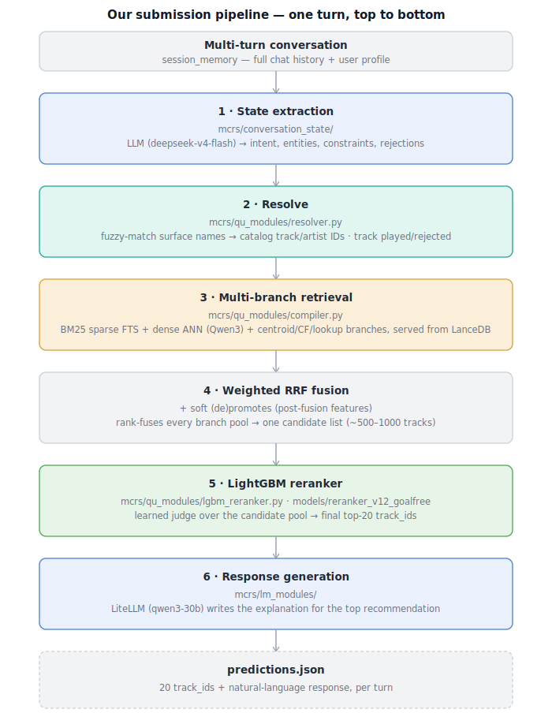

# Music-CRS — Our RecSys 2026 Music Conversational Recommendation Submission

Our entry to the **[RecSys 2026 Music Conversational Recommendation Challenge](https://nlp4musa.github.io/music-crs-challenge/)**: given a multi-turn conversation, retrieve 20 tracks from a 47k-track catalog and generate a natural-language response explaining them.

Built on top of the organizers' official baseline/evaluation framework (task format, dataset loaders, inference contract). Everything past the original two-stage BM25/BERT + Llama-3.2-1B baseline — the state extraction, multi-branch retrieval, RRF fusion, learned reranker, and response generation — is our own pipeline, described below.

- **Challenge site**: https://nlp4musa.github.io/music-crs-challenge/
- **ACM RecSys Challenge**: https://www.recsyschallenge.com/2026
- **Datasets**: [TalkPlayData-Challenge collection](https://huggingface.co/collections/talkpl-ai/talkplay-data-challenge)
- **Scores**: see [below](#scores) — devset, Blind-A, and Blind-B across every reported facet

---

## Approach overview

Each turn compiles the running conversation into a structured state, retrieves candidates through several independent retrievers, fuses and reranks them, and generates a response for the top pick.



Full detail per stage:

- [docs/architectures/v0plus_retrieval.md](docs/architectures/v0plus_retrieval.md) — retriever branches, RRF fusion math, post-fusion features
- [docs/architectures/session_state.md](docs/architectures/session_state.md) — the state schema and extract→resolve pipeline
- [docs/reproduce_reranker.md](docs/reproduce_reranker.md) — LightGBM reranker: features, training, FAST vs FULL retrain
- [docs/architectures/explanation_generation.md](docs/architectures/explanation_generation.md) — response generation

(Full per-module map is in [Repo map](#repo-map) below.)

---

## Scores

| Split | NDCG@20 | Catalog Diversity | Lexical Diversity | LLM-as-a-Judge | Composite | Source |
|---|---:|---:|---:|---:|---:|---|
| Devset | 0.4562 | — | — | — | — | Local evaluator ([leaderboard.md](leaderboard.md)) |
| Blind-A | 0.4380 | 0.0313 | 0.7670 | 4.2000 | **0.5389** | CodaBench submission `797598` |
| Blind-B | 0.2537 | 0.0315 | 0.7862 | 3.3000 | **0.3811** | CodaBench final leaderboard (rank 29) |

Devset extras (no CodaBench equivalent): Hit@20 0.6138, MRR 0.4102 — see [leaderboard.md](leaderboard.md) for deep-cutoff diagnostics (@50–@1000) and per-stage recall breakdowns.

Devset and Blind-A/B aren't directly comparable: devset is scored locally against public ground truth with a different metric surface (no organizer-side Composite/Catalog Diversity/Lexical Diversity/LLM-as-a-Judge), while Blind-A/B are scored by CodaBench against held-out labels on the exact facets shown above.

⚠️ The devset NDCG@20 above is the last full 50-shard Modal capture (2026-06-15); a later local recapture after subsequent reranker fixes showed a lower number (0.3844), not yet reconfirmed with a fresh full Modal run — see `leaderboard.md`'s discrepancy note before treating 0.4562 as current.

---

## Reproducing our results

Two independent things you can do, both documented for the organizers' code-review process.

### Zero-credential reproduction (Blind-A/B)

Self-contained — creates its own venv and installs its own deps, skipping the [Setup](#setup) section below entirely. No Modal, HF, or LLM credentials needed either way. Downloads a bundled cache (catalog, embeddings, extracted state, frozen LLM cache) from Hugging Face and runs Blind-B end to end:

```bash
scripts/repro_setup.sh   # downloads + verifies the offline bundle
scripts/repro_run.sh     # runs Blind-B, no credentials, no Modal
```

Verified under a network fence (Modal genuinely unreachable) across all of devset/Blind-A/Blind-B. See [docs/reproduce_offline_bundle.md](docs/reproduce_offline_bundle.md) for the byte-exact frozen-replay path vs. this live rerun, and how to check the reported score rather than just the prediction file.

### Training the models from scratch

Rebuilds the LightGBM reranker and/or the b1 bi-encoder — needs the [Setup](#setup) below plus Modal + the usual credentials:

```bash
# LightGBM reranker: rebuild retrieval traces/features, retrain on Modal.
# See docs/reproduce_reranker.md for the full command sequence.

# b1 bi-encoder (the fine-tuned Qwen3-Embedding conv->track retriever
# behind the b1_cos reranker feature):
modal run scripts/rerank/modal_train_biencoder.py
modal volume get scout-models /biencoder_qwen06_eN ./models/   # N = 1,2,3 (one checkpoint/epoch)
# See docs/architectures/biencoder.md for the training recipe (MNRL, MOVES-only
# positives, known-for field dropout) and how the checkpoint gets promoted/served.
```

Offline bundle (catalog, caches, frozen traces, model weights): **https://huggingface.co/datasets/Npatta01/music-crs-repro-2026**

---

## Submission file

Our current active configs (all use `models/reranker_v12_goalfree`, committed in-repo; all set `track_split_types: ["all_tracks"]`, so retrieval always searches the full 47k-track catalog — none subset it during inference):

| Config | Role |
|---|---|
| `configs/state_ranker_v10_lgbm_blindset_A.yaml` | Blind-A submission |
| `configs/state_ranker_v10_lgbm_blindset_B.yaml` | Blind-B submission |
| `configs/state_ranker_v10_lgbm_devset.yaml` | Devset scoring |
| `configs/state_ranker_v10_rrf_devset.yaml` | Explicit RRF/candidate-fusion baseline (no reranker) |

`prediction.json` is packaged with:

```bash
bash prepare_submission.sh state_ranker_v10_lgbm_blindset_B blindset_B
```

which copies `exp/inference/blindset_B/state_ranker_v10_lgbm_blindset_B.json` → `submission/prediction.json` and zips it. Previously submitted zips are kept in [`submission/`](submission/).

---

## Setup

Needed for the live/credentialed paths — [Running inference](#running-inference) below, and [Training the models from scratch](#training-the-models-from-scratch) above. `scripts/repro_setup.sh` in the zero-credential path above already creates its own venv and runs `uv pip install -e .` internally, so the overlap with the commands below is real — but it deliberately does **not** run `hf auth login` or `modal setup`, and it pulls down a multi-GB offline bundle you don't want for live work. That's what this section is actually for: credentials, not just a Python env.

```bash
uv venv .venv --python=3.12
source .venv/bin/activate
uv pip install -e .

uvx hf auth login   # HF account with access to the TalkPlay Data Challenge collection
```

Cloud GPU runs (Modal):

```bash
uv run python -m modal setup
uv run modal run other/modal_get_started.py   # smoke test
```

---

## Running inference

This is for genuinely fresh runs — different from [zero-credential reproduction](#zero-credential-reproduction-blind-ab) above, which only replays the exact sessions already frozen into that bundle. Either `--backend` here needs real credentials (see [Setup](#setup)); `local` just means the orchestration runs on this machine instead of dispatching to Modal's workers, not that it's free.

```bash
# Blind-A / Blind-B submission paths — 80 sessions, practical locally (~10 min, no Modal account needed)
python run_experiment.py --backend local --tid state_ranker_v10_lgbm_blindset_A --eval_dataset blindset_A --batch_size 8
python run_experiment.py --backend local --tid state_ranker_v10_lgbm_blindset_B --eval_dataset blindset_B --batch_size 8

# Devset — current goal-free LGBM reranker. 1000 sessions (~12x blindset); Modal's default
# 50-way sharding keeps this practical. `--backend local` also works (CLAUDE.md), but expect
# well over an hour single-shard -- pass --num_shards/--num_workers to parallelize locally.
python run_experiment.py --backend modal --tid state_ranker_v10_lgbm_devset --batch_size 8

# Faster local iteration: retrieval once, LambdaMART replay/eval from the saved trace
python run_pipeline.py --config configs/pipelines/state_ranker_v10_lgbm_devset.yaml
```

Predictions land in `exp/inference/{split}/{tid}.json`. See [CLAUDE.md](CLAUDE.md) for the full command reference and shared-cache setup for local worktrees.

---

## Repo map

- [docs/codebase/README.md](docs/codebase/README.md) — start here for per-module internals and the verified-bugs audit
- [docs/data.md](docs/data.md) — dataset schemas, splits, inference output format
- [docs/evaluation.md](docs/evaluation.md) — metrics, devset leaderboard setup
- [experiments/README.md](experiments/README.md) — current config/report index (pruned intentionally; see git history for older waves)
- [changelog.md](changelog.md) — PR-linked outcomes (score table is in [Scores](#scores) above)
- [tips/](tips/) — extension ideas we didn't pursue (better item representations, generative retrieval, etc.)

---

## Acknowledgments

Built on the RecSys 2026 Music-CRS organizers' baseline evaluation framework and the [TalkPlayData-Challenge](https://huggingface.co/collections/talkpl-ai/talkplay-data-challenge) datasets. Thanks to the organizing committee for the challenge and infrastructure.
